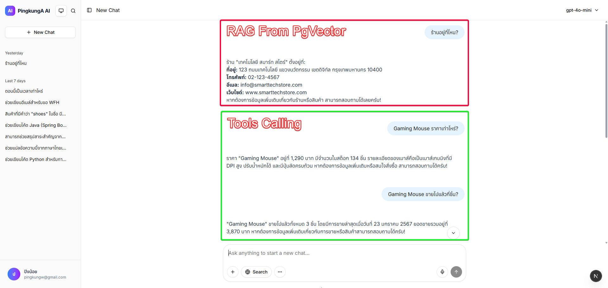
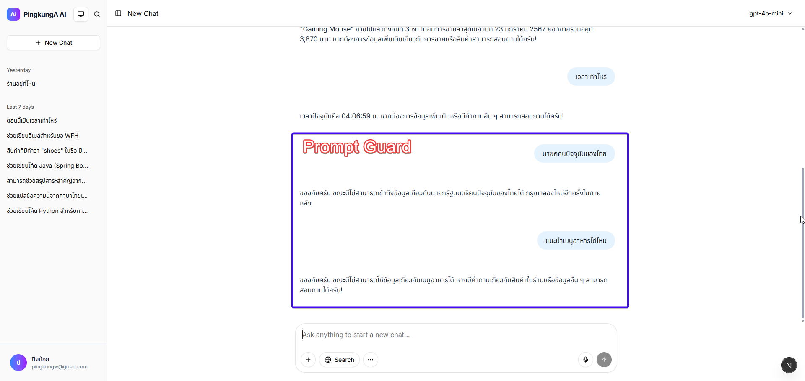

# AI Chatbot Next.js + LangChain + AI SDK

This project is a modern AI chatbot platform built with [Next.js](https://nextjs.org), integrating [LangChain](https://js.langchain.com/) and [AI SDK](https://github.com/vercel/ai) for advanced conversational AI features, streaming, and UI components.

## Features

- Built with Next.js App Router
- AI SDK integration for chat, streaming, and UI
- LangChain for advanced LLM orchestration
- Supabase authentication (example)
- Middleware for session and route protection
- Custom API endpoints for authentication and chat


## Environment Variables

This project uses environment variables for API keys and service configuration. See the `.env.example` file for all required variables. All sensitive values in `.env.example` are blurred or replaced with placeholders for safety.

**To use:**

1. Copy `.env.example` to `.env` in your project root:
	```bash
	cp .env.example .env
	```
2. Fill in your real API keys and credentials in the new `.env` file.

---
## Getting Started

Install dependencies:

```bash
npm install
# or
yarn install
```

Run the development server (default port 3000):

```bash
npm run dev
```

Or run on a custom port (e.g. 4000):

```powershell
$env:PORT=4000; npm run dev
```

Open [http://localhost:3000](http://localhost:3000) or your chosen port in your browser.

## Project Structure

```
├── public/                     # Static assets (images, icons, etc.)
├── src/
│   ├── app/                    # Next.js app directory (routing, pages, API, components)
│   │   ├── page.tsx            # Home page
│   │   ├── chat/
│   │   │   └── page.tsx        # Chat page (AI SDK + LangChain)
│   │   ├── simplechat/
│   │   │   └── page.tsx        # Simple chat page
│   │   └── api/
│   │       └── check-auth/
│   │           └── route.ts    # API route for authentication check
│   ├── components/             # React components (e.g. ChatPromptKitFull, ChatSimple)
│   ├── lib/                    # Shared libraries (e.g. Supabase client)
│   └── middleware.ts           # Route protection and session middleware
├── package.json                # Project dependencies and scripts
├── tsconfig.json               # TypeScript configuration
├── next.config.ts              # Next.js configuration
├── postcss.config.mjs          # PostCSS configuration
├── eslint.config.mjs           # ESLint configuration
└── README.md                   # Project documentation
```

## Usage
- Home page (`/`) is public
- All other pages require login (see `src/middleware.ts`)
- Chat page uses AI SDK and LangChain for streaming chat (`/chat`)

#### Sample Prompts for Tool Calling

You can use the following sample prompts to interact with the chatbot and trigger tool calls:

##### Tool 1: getProductInfoTool - ดูข้อมูลสินค้า
- Gaming Mouse ราคาเท่าไหร่?
- Smartwatch มีในสต็อกไหม?
- Earbuds มีรายละเอียดสินค้าอย่างไร?

##### Tool 2: getSalesDataTool - ดูประวัติการขาย
- ขาย Gaming Mouse ได้กี่ชิ้นในเดือนที่ผ่านมา?
- Smartwatch ขายไปแล้วกี่ชิ้น?
- สรุปยอดขายของสินค้า Mechanical Keyboard

##### เรียกทำงานพร้อมกันทั้ง 2 Tools
- สินค้า Running Shoes ราคาเท่าไหร่ และขายไปแล้วกี่ชิ้น?
- Gaming Mouse ขายไปได้กี่ชิ้นแล้ว และตอนนี้เหลือในสต็อกเท่าไหร่?
- Smartwatch มีรายละเอียดสินค้าอย่างไร และขายไปแล้วกี่ชิ้น?

##### แสดงเป็นตาราง Markdown
- สินค้าที่มีคำว่า "shoes" ในชื่อ มีอะไรบ้าง แสดงเป็นตาราง
- เปรียบเทียบยอดขายของ Gaming Mouse และ E-book Reader แสดงในตาราง

คุณสามารถถามคำถามทั่วไปได้ด้วยเช่นกัน


## Document Chunking

แบ่ง document ออกเป็นชิ้นๆ และ overlap กัน context จะได้ไม่ขาดกัน

```
 เริ่มโหลดเอกสารจากโฟลเดอร์ data/...
📋 ไม่พบข้อมูลเก่า - เริ่มโหลดเอกสารใหม่
Unknown file type: product.pdf
Unknown file type: product.csv
📄 โหลดเอกสารสำเร็จ: 1 ไฟล์
✂️ แยกเอกสารเป็น 3 ชิ้น

--- 🧐 ตัวอย่าง 3 Chunks แรก ---

--- Chunk 1 ---
เนื้อหา (Content): ชื่อร้าน: เทคโนโลยี สมาร์ท สโตร์
ที่อยู่: 123 ถนนเทคโนโลยี แขวงนวัตกรรม เขตดิจิทัล กรุงเทพมหานคร 10400
โทรศัพท์: 02-123-4567
อีเมล: info@smarttechstore.com
เว็บไซต์: www.smarttechstore.com

เวลาทำการ:
จันทร์ - ศุกร์: 09:00 - 20:00 น.
เสาร์ - อาทิทย์: 10:00 - 21:00 น.

ประเภทสินค้า:
สมาร์ทโฟน iPhone, Samsung, Xiaomi
แท็บเล็ต iPad, Android Tablet
คอมพิวเตอร์ MacBook, Windows Laptop
อุปกรณ์เสริม หูฟัง, เคส, ที่ชาร์จ
ลำโพง Bluetooth Speaker, Soundbar
ขนาด (Size): 465
ข้อมูลอ้างอิง (Metadata): {
  source: 'D:\\2WarRoom\\2025AIChatbot\\aichatbotnext-langchain\\data\\text_csv\\infomation.txt',
  loc: { lines: { from: 1, to: 16 } }
}
---------------------


--- Chunk 2 ---
เนื้อหา (Content): อุปกรณ์เสริม หูฟัง, เคส, ที่ชาร์จ
ลำโพง Bluetooth Speaker, Soundbar
เกมมิ่ง Gaming Mouse, Keyboard, Monitor

บริการพิเศษ:
ส่วนลดสมาชิก 10% สำหรับลูกค้าประจำ
บริการซ่อมสินค้า ภายใน 24 ชั่วโมง
จัดส่งฟรี สำหรับการสั่งซื้อมากกว่า 2,000 บาท
ผ่อน 0% นาน 10 เดือน สำหรับบัตรเครดิตธนาคารหลัก
รับประกันสินค้า 1-2 ปี ตามประเภทสินค้า

การชำระเงิน:
เงินสด
บัตรเครดิต/เดบิต
โมบายแบงก์กิ้ง
QR Code PromptPay
บัตรกิฟต์ของร้าน

ช่องทางการติดต่อ:
Facebook: Smart Tech Store Official
ขนาด (Size): 484
ข้อมูลอ้างอิง (Metadata): {
  source: 'D:\\2WarRoom\\2025AIChatbot\\aichatbotnext-langchain\\data\\text_csv\\infomation.txt',
  loc: { lines: { from: 15, to: 34 } }
}
---------------------


--- Chunk 3 ---
เนื้อหา (Content): QR Code PromptPay
บัตรกิฟต์ของร้าน

ช่องทางการติดต่อ:
Facebook: Smart Tech Store Official
Line ID: @smarttechstore
Instagram: @smarttech_store
YouTube: Smart Tech Store Thailand

ความเชี่ยวชาญ:
ทีมงานมีประสบการณ์มากกว่า 10 ปี
ให้คำปรึกษาสินค้าเทคโนโลยี
อัพเดทเทรนด์เทคโนโลยีใหม่ๆ
มีสินค้าพร้อมส่งมากกว่า 1,000 รายการ

ภารกิจ:
นำเทคโนโลยีที่ดีที่สุดมาให้ลูกค้า
สร้างประสบการณ์การช้อปปิ้งที่ยอดเยี่ยม
ให้บริการหลังการขายที่เป็นเลิศ
พัฒนานวัตกรรมเพื่อความสะดวกของลูกค้า
ขนาด (Size): 485
ข้อมูลอ้างอิง (Metadata): {
  source: 'D:\\2WarRoom\\2025AIChatbot\\aichatbotnext-langchain\\data\\text_csv\\infomation.txt',
  loc: { lines: { from: 30, to: 49 } }
}
```

บางเคส Chunk มีปัญหาได้ อย่าง Training Shoes 2390 พอแบ่ง Chunk 239089 มันเอา 89 ของ Record ถัดไปมาต่อเลย ถามราคาผิด 

```
--- Chunk 1 ---
เนื้อหา (Content): idpidnamedescriptionpricestockcategoryimage_url 1 P 001 Running Shoes รองเท้าวิ่งนํ้าหนักเบารองรับแรงกระแทกเหมาะกับกา         ารวิ่งระยะไกล 2590156 Sports / images/p 1.png 2 P 002 Training Shoes รองเท้าฝึกซ้อมในยิมพื้นยึดเกาะดีระบายอากาศ 239089 Sports / images/p           2.png 3 P 003 Football Boots รองเท้าสตั๊ดสําหรับสนามหญ้าเกาะพื้นดียิงแม่นยํา 329034 Sports / images/p 3.png 4 P 004 Yoga Mat แผ่นโยคะกัน             นลื่นหนาพกพาง่ายเหมาะโยคะ / พิลาทิส 99078 Fitness / images/p 4.png 5 P 005 Smartwatch Series A นาฬิกาอัจฉริยะติดตามสุขภาพนับก้าวแจ้งเตือน             นสาย 4990123 Electronics / images/p 5.png 6 P 006 Wireless Earbuds หูฟังไร้สายเสียงชัดแบตอึดกันนํ้าระดับ IPX 4219067 Electronics / images         s/p 6.png 7 P 0074 KAction Camera กล้องแอคชัน 4 K กันสั่นกันนํ้าเหมาะเที่ยวผจญภัย 599045 Electronics / images/p 7.png 8 P 008 Office Chai          ir เก้าอี้สํานักงานรองรับสรีระปรับระดับได้นั่งสบาย 399029 Furniture / images/p 8.png 9 P 009 Gaming Mouse เมาส์เกมมิง DPI สูงปรับนํ้าหนัก                  กปุ่มลัดครบ 1290134 Electronics / images/p 9
```

## RAG + Tools Calling





## API Note

| API Endpoint                                         | คำอธิบาย (TH)                                   | หมายเหตุ/ตัวอย่างการใช้งาน                |
|------------------------------------------------------|--------------------------------------------------|---------------------------------------------|
| `/api/chat_01_start`                                 | แชทเริ่มต้น/ทดสอบระบบแชทพื้นฐาน                | รับข้อความ ส่งกลับข้อความตอบ                |
| `/api/chat_02_request`                               | แชทแบบ request-response ธรรมดา                   | ส่งข้อความ รับคำตอบทันที                   |
| `/api/chat_03_template`                              | แชทด้วย prompt template                          | ใช้ template ในการสร้าง prompt              |
| `/api/chat_04_stream`                                | แชทแบบสตรีมมิ่ง (Streaming)                      | รับข้อความตอบแบบทีละส่วน (stream)           |
| `/api/chat_05_history`                               | แชทพร้อมบันทึกประวัติข้อความ                    | เก็บและดึงประวัติการสนทนา                  |
| `/api/chat_06_history_optimize`                      | แชท + ประวัติ + สรุปข้อความ + trim token        | จัดการ session, สรุป, จำกัด token           |
| `/api/chat_06_history_summary`                       | แชท + สรุปประวัติข้อความ                        | สรุปเนื้อหาการสนทนา                        |
| `/api/chat_07_history_with_tool_calling`             | แชท + ประวัติ + เรียกใช้งาน tools               | ใช้ tools เช่น ข้อมูลสินค้า/ยอดขาย           |
| `/api/chat_07_tool_calling_sample`                   | ตัวอย่างการเรียกใช้งาน tools ในแชท              | ตัวอย่าง prompt สำหรับ tools                |
| `/api/chat_08_rag`                                   | แชทแบบ RAG (Retrieval-Augmented Generation)      | ดึงข้อมูลจากเอกสาร/ฐานข้อมูล                |
| `/api/chat_09_rag_tool_calling`                      | RAG + เรียกใช้งาน tools ในแชท                    | รวม RAG กับ tool calling                    |
| `/api/chat_09_rag_tool_calling/session`              | จัดการ session สำหรับ RAG + tool calling         | สร้าง/ดึง session แยกสำหรับ RAG             |
| `/api/check-auth`                                    | ตรวจสอบสถานะการล็อกอินของผู้ใช้                 | ใช้สำหรับป้องกัน route                      |
| `/api/document_loader_embeding_pgvector/text_csv`     | โหลดเอกสาร TXT/CSV สำหรับ embedding ด้วย pgvector + AI embedding Model      | รองรับ TXT, CSV, chunk, embedding           |
| `/api/document_loader_embeding_pgvector/text_csv_pdf`    | โหลดเอกสาร TXT/CSV/PDF สำหรับ embedding ด้วย pgvector + AI embedding Model | ใช้กับ pgvector, chunk ข้อมูล  ตัด pdf             |

## Notes

- AI SDK can be used as a LangChain alternative for some use cases, but is still evolving
- Supports streaming responses and UI out-of-the-box
- For authentication, Supabase is used as an example (can be replaced)

## Build

```
docker build -t pingkunga/pingnextbot:0.0.3 .  

docker run --env-file .env -p 33000:3000 pingkunga/pingnextbot:0.0.3

docker push pingkunga/pingnextbot:0.0.3    
```


## Resources

- [Next.js Documentation](https://nextjs.org/docs)
- [LangChain.js Documentation](https://js.langchain.com/docs/)
- [AI SDK by Vercel](https://github.com/vercel/ai)

---

Feel free to customize and extend this project for your own AI chatbot needs!